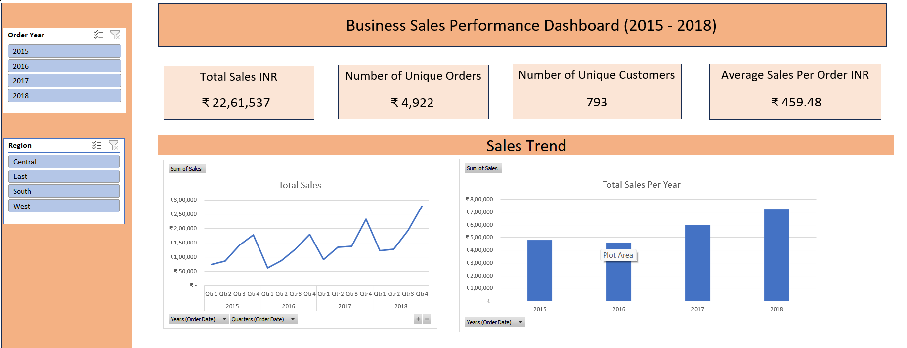
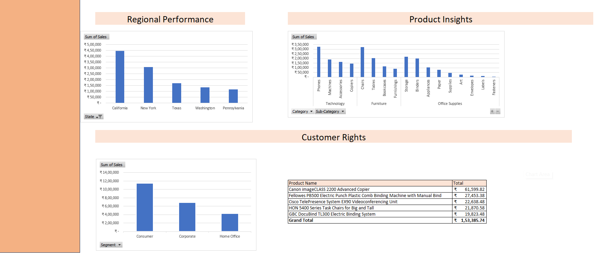
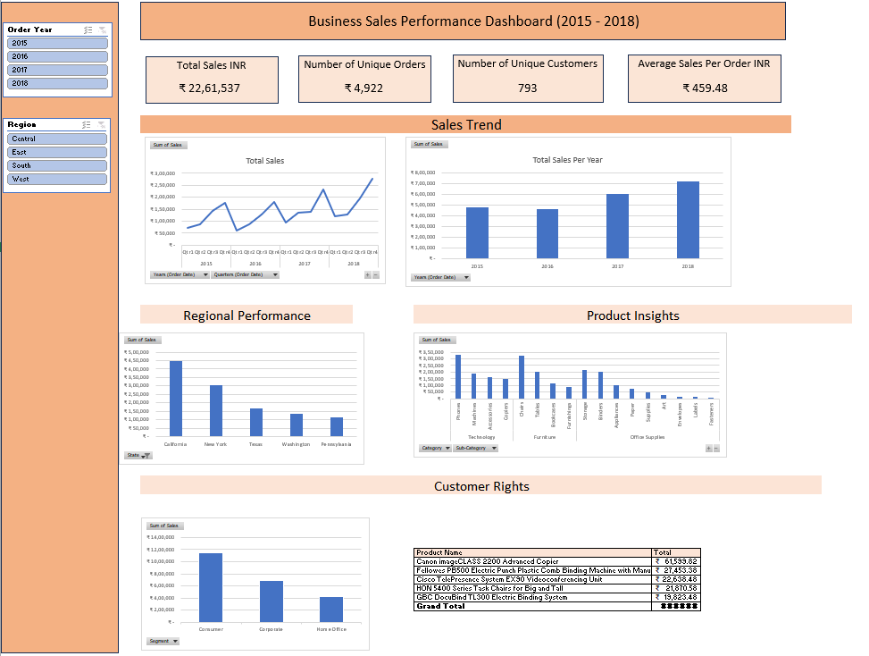

# 📊 Business Sales Performance Analysis Dashboard (2015–2018)

## 📌 Project Overview

Developed an interactive Excel dashboard to analyze multi-year sales data (2015–2018), transforming raw transactional data into actionable insights on revenue growth, customer behavior, and regional performance.

---

## 🎯 Business Objectives

* Analyze revenue growth trends over time
* Identify top-performing products and regions
* Evaluate customer segments and purchasing behavior
* Track key performance indicators (KPIs) for business monitoring

---

## 🛠 Technology Stack

* Microsoft Excel (Data Cleaning, Pivot Tables, Dashboard Development)
* Data Aggregation & Trend Analysis

---

## 📊 Key Metrics

* **Total Revenue:** ₹22,61,537
* **Total Orders:** 4,922
* **Unique Customers:** 793
* **Average Order Value:** ₹459.48

---

## 📈 Key Business Insights

* Achieved consistent revenue growth from 2015 to 2018, indicating strong business expansion
* California emerged as the top-performing region with ~₹4.5L+ in total sales
* Laptops and technology products contributed the highest share of total revenue
* Top-performing product generated ~₹61K+, highlighting high-value SKU contribution
* Consumer segment accounted for the largest share of total sales, followed by corporate and home office
* Quarterly sales trends revealed fluctuations, indicating opportunities for demand forecasting and inventory planning

---

## 📊 Analysis Performed

* Conducted product-level revenue analysis to identify top-performing SKUs
* Performed region-wise sales analysis to highlight high-revenue markets
* Built KPI dashboard with summary cards for real-time performance tracking
* Analyzed customer segments to understand purchasing behavior
* Evaluated year-wise and quarterly trends for business growth insights

---

## 📷 Dashboard Preview

### Sales Overview

### Regional Analysis

### Full Report

---

## 💼 Business Impact

* Enabled identification of high-revenue products and regions for targeted growth strategies
* Provided visibility into sales trends to support forecasting and planning
* Improved decision-making through centralized KPI monitoring
* Highlighted customer segments driving the majority of revenue

---

## 🚀 Project Outcome

This dashboard provides a comprehensive view of business performance, enabling stakeholders to monitor KPIs, identify growth opportunities, and make data-driven strategic decisions.

---

## 👤 About the Author

**Daman Komu** *Data Analyst | Business Intelligence Specialist*

I am a results-driven Data Analyst passionate about transforming raw data into actionable business insights. My expertise lies in building interactive dashboards, identifying market trends, and optimizing data workflows to drive informed decision-making.

### 🛠️ Technical Stack
 
 
 

# 📬 Contact & Connect

